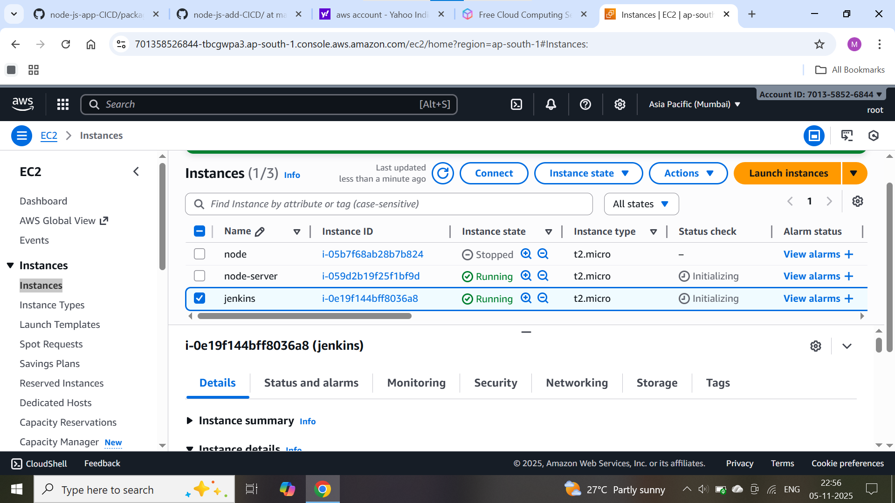
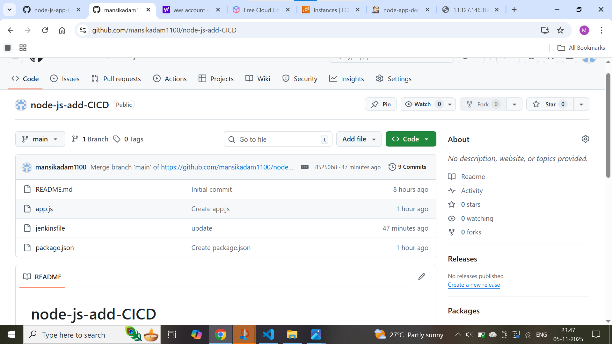
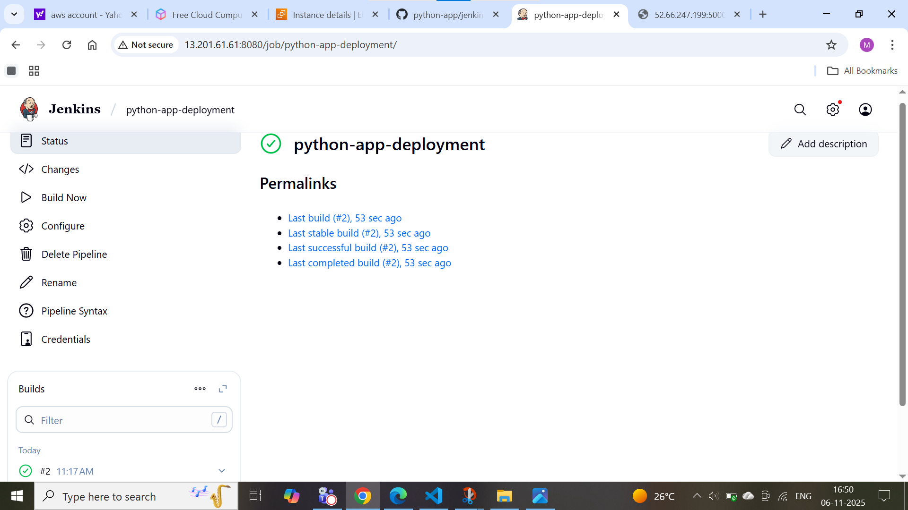
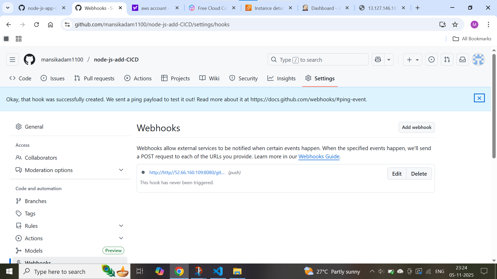
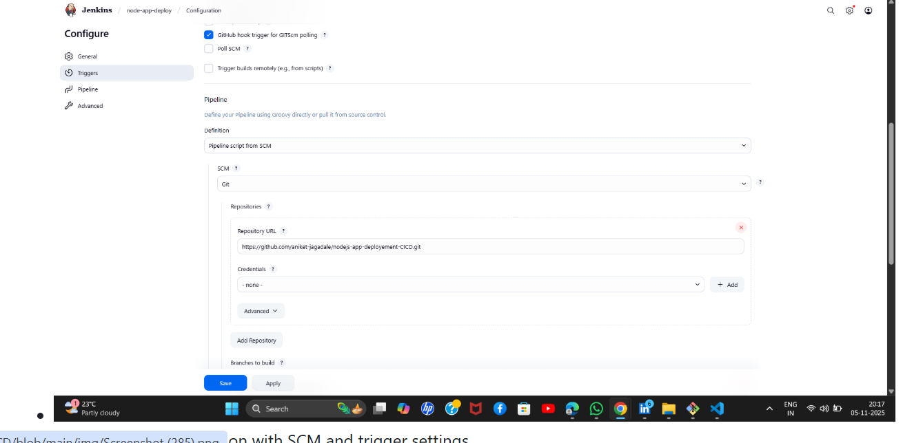
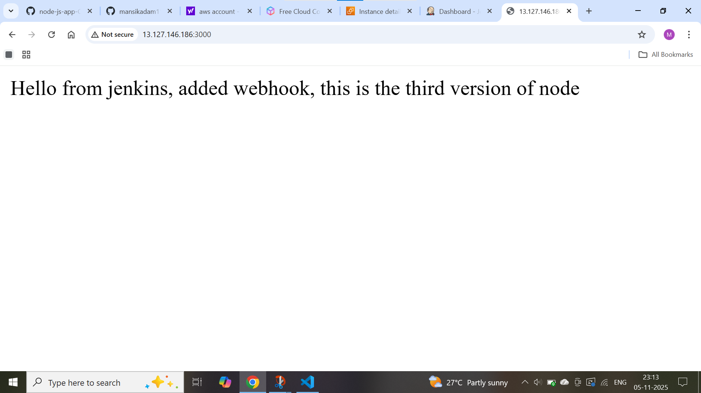

# Node-js-App-CICD 

## Project Overview

This project implements a complete CI/CD pipeline for a Node.js application deployment using Jenkins, AWS EC2, and GitHub integration. The pipeline automates the build, test, and deployment process whenever code changes are pushed to the repository.

## Architecture Diagram

## Pipeline Components

### 1. Source Control (GitHub)
- **Repository**: `node-js-app--CICD`
- **Branches**: main, caller-jagadale
- **Webhooks**: Configured for automatic Jenkins build triggers
- **Files**: 
  - `app.js` - Node.js application code
  - `Jenkinsfile` - Pipeline configuration
  - `package.json` - Dependencies and scripts

### 2. CI/CD Server (Jenkins)
- **Pipeline Name**: `node-app-deploy`
- **Configuration**: 
  - GitHub SCM integration
  - Webhook triggers for automatic builds
  - Pipeline script from SCM
- **Build Status**: Successful deployments tracked

### 3. Deployment Target (AWS EC2)
- **Instance**: `node-app-deployment` (i-027870cd570812ea6)
- **Region**: us-east-1
- **Availability Zones**: us-east-1a, us-east-1b, us-east-1c
- **Network**: 
  - Public IPv4: 54.173.8.166
  - Private IPv4: 172.31.30.197

## Screenshots

### Infrastructure Management
  - AWS EC2 Dashboard showing instance details and management console
-- GitHub repository structure and code management

### CI/CD Pipeline
-  - Jenkins pipeline dashboard with build history and status
-  - GitHub webhooks configuration for Jenkins integration
-  - Jenkins job configuration with SCM and trigger settings

### Deployment Results
-  - Successful application deployment output

## Pipeline Workflow

1. **Code Commit** → Developer pushes changes to GitHub
2. **Webhook Trigger** → GitHub notifies Jenkins via webhook
3. **Build Execution** → Jenkins pulls latest code and runs pipeline
4. **Deployment** → Application deployed to AWS EC2 instances
5. **Verification** → Health checks and status monitoring

## Features

- ✅ Automated builds on code changes
- ✅ Zero-downtime deployments
- ✅ Multi-environment support (Production/Staging)
- ✅ Rollback capabilities
- ✅ Build status notifications
- ✅ Comprehensive monitoring

## Technologies Used

- **Version Control**: GitHub
- **CI/CD Server**: Jenkins
- **Cloud Provider**: AWS EC2
- **Application**: Node.js
- **Orchestration**: Jenkins Pipeline
- **Integration**: GitHub Webhooks

## Getting Started

### Prerequisites
- Jenkins server with necessary plugins
- AWS EC2 instances configured
- GitHub repository with webhooks
- Node.js application code

### Setup Instructions
1. Configure Jenkins pipeline with GitHub repository URL
2. Set up AWS EC2 instances in target regions
3. Configure GitHub webhooks for Jenkins integration
4. Define deployment scripts in Jenkinsfile
5. Test the pipeline with sample deployments

## Monitoring and Logs

- Jenkins build history and console output
- AWS EC2 instance status checks
- GitHub webhook delivery status
- Application health endpoints

---